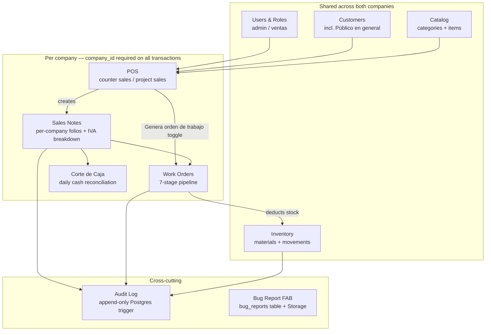
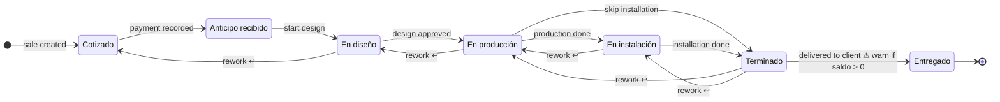
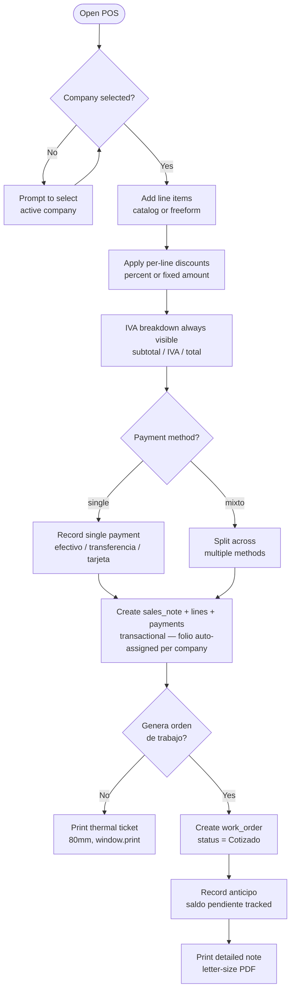
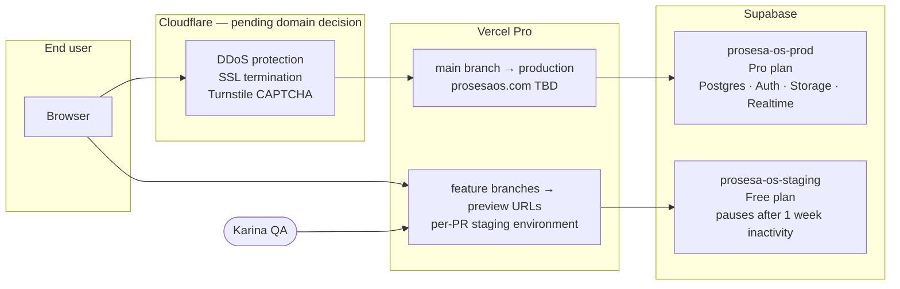
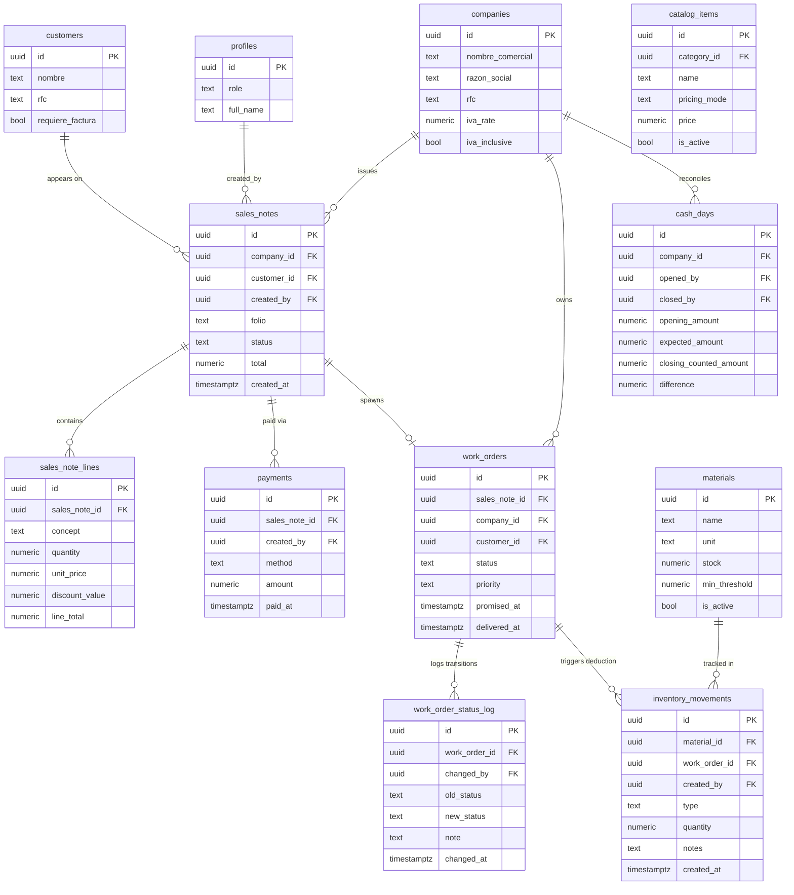

# ProsesaOS — Architecture & Module Diagrams

---

## 1. Module Map

How the eight feature modules relate and which data they share across companies vs. per company.

---

## 2. Work Order Pipeline

Seven-stage pipeline. `En instalación` is skippable. Backward (rework) transitions are allowed and always logged.

---

## 3. POS Data Flow

End-to-end flow from opening the POS to generating a sales note and optionally a work order.

---

## 4. Deployment Architecture

---

## 5. Core Data Model

Key business entities and their relationships. Full column definitions in `supabase/migrations/`.

---

## Changelog

| Date | Change |
|---|---|
| 2026-04-14 | Initial architecture diagrams for Phase 1. |
